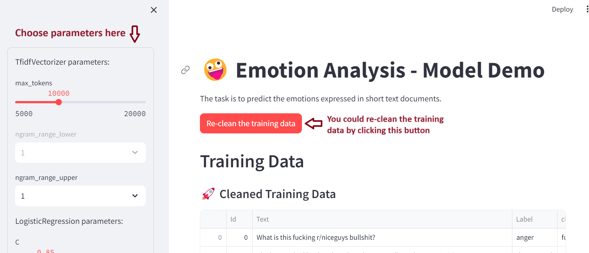

# Emotion Analysis Model Demo

### Info
1. All the data is stored in the sub-folder `data`  
The original data files are train.csv and test.csv. The program will clean up the data and put them in cleaned_train.csv and cleaned_test.csv.

2. Data cleaning plays an important role in the accuracy of the model performance. The cleaning work is done in the file `common_code.py` - `clean_text` function.

3. `USE.ipynb` is an independent file. It uses the universal sentence encoder to encode each doc and try difference models.

### How to run this project
1. Install streamlit: pip install streamlit
2. Install other Python packages necessary.
3. In the command line, run `streamlit run emotion_analysis_app.py`
4. Check the streamlit page in the opened browser page. You could choose the parameters on the page to update the model running result.

